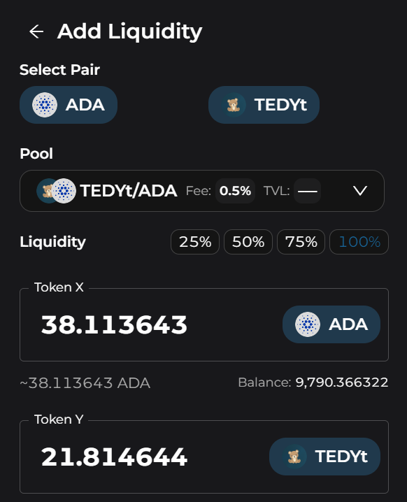

# How to Add Liquidity

1. To add liquidity, start by clicking the "Liquidity" link in the navigation menu at the top
2. Click the "Add Liquidity" button on the right

3. Choose which tokens you'd like to add
4. Type the amount of liquidity you'd like to add. You need equal values of each token from the pair. If you don't have enough, you can swap for more. Alternatively, you can choose from the percent buttons. 

5. Hit the "Add liquidity" button, confirm the details, and sign the transaction. You're now providing liquidity to the DEX and will receive LP tokens to your wallet. 
