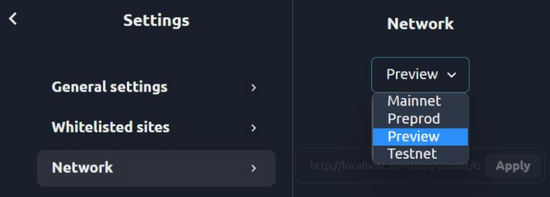

# Nami Setup

1. Click on your user icon, and select "Settings"

2. Under network, choose "Preview" from the drop-down

 

3. You will now see "Preview" in the bottom left corner

4. You may now receive testnet tokens from the Cardano testnet faucet: https://docs.cardano.org/cardano-testnet/tools/faucet
