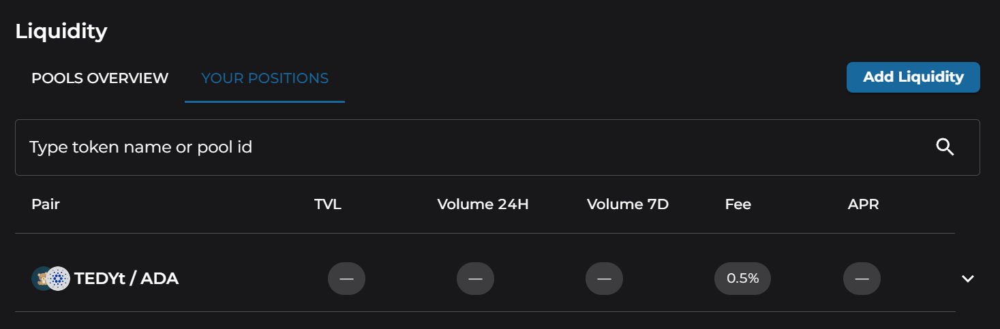
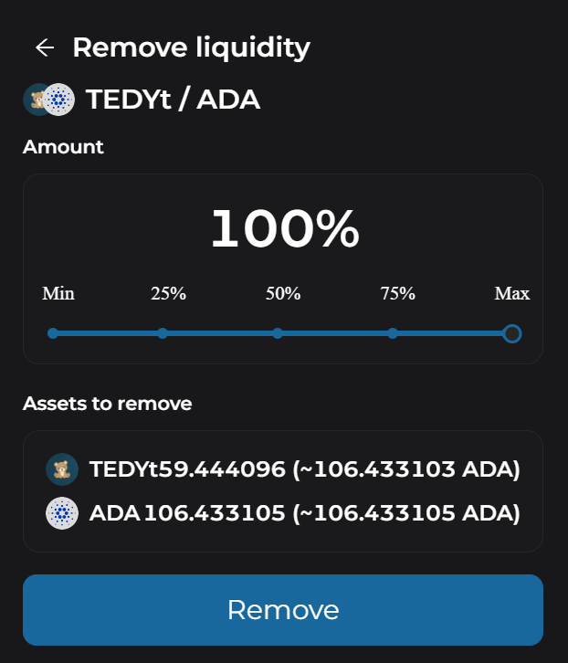

# How to Redeem Liquidity

1. To remove liquidity from the platform, choose "Liquidity" from the navigation menu, and then select the "Your Positions" tab. 

2. Click on the position you'd like to exit, and it will drop-down more details. Choose "Pool Overview"
3. On the Pool Overview page, choose "Remove Liquidity"
4. Choose how much of your liquidity you'd like to remove, 100% for all of it, and click "Remove"

5. Confirm the transaction details, click "Remove Liquidity" and sign the transaction. You will receive the separate tokens back to your wallet. 
