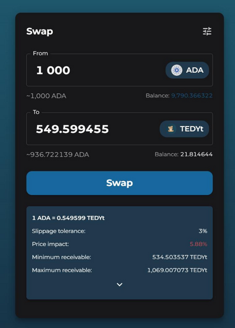

# How to Swap
## How to swap tokens on the DEX

1. Select “Swap” from the menu if its not already selected
2. From the “Select a token” dropdown, choose a token of your choice to swap ADA into. 
3. Enter the amount of ADA you’d like to swap. 

4. You can change the settings with the settings button in the top-right of the Swap window. This allows you to set slippage values, and sweeten the pot with extra honey which provides badgers a higher incentive to take your transaction ahead of others. 

5. Review the slippage tolerance, price impact , and other details, then click “Swap”
6. You may review the details again and hit “Confirm Swap” to bring up the signing window
7. Sign the transaction and click “View on explorer” to verify the success of the transaction . You will also see the tokens in your wallet once the transaction is completed. 
